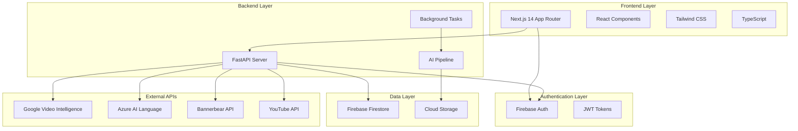
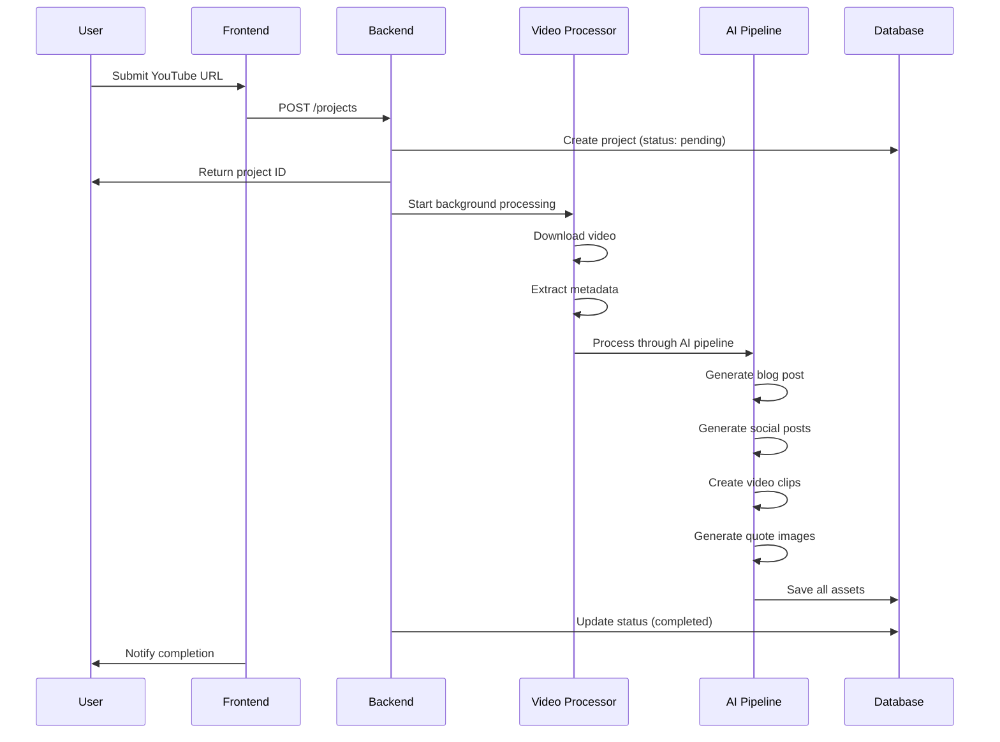

# Design Document

## Overview

Content Catalyst AI is a full-stack web application that leverages artificial intelligence to transform YouTube videos into comprehensive content marketing packages. The system follows a modern microservices architecture with a React/Next.js frontend, FastAPI backend, and Firebase for authentication and data storage.

## Architecture

### High-Level Architecture



### System Components

The application is structured as a monorepo with clear separation between frontend and backend concerns:

- **Frontend**: Next.js 14 application with TypeScript and Tailwind CSS
- **Backend**: FastAPI server with Python for AI processing
- **Database**: Firebase Firestore for user data and project metadata
- **Storage**: Cloud storage for processed video files and generated assets
- **Authentication**: Firebase Authentication with email/password and Google OAuth

## Components and Interfaces

### Frontend Components

#### Core Pages
- **Landing Page** (`components/LandingPage.tsx`): Marketing page with feature showcase
- **Authentication Pages** (`app/auth/login/page.tsx`, `app/auth/signup/page.tsx`): User registration and login
- **Dashboard** (`app/dashboard/page.tsx`): Project management interface
- **Project View** (`app/project/[id]/page.tsx`): Individual project results display

#### Shared Components
- **Error Boundary** (`components/ErrorBoundary.tsx`): Global error handling
- **Auth Context** (`lib/auth-context.tsx`): Authentication state management

#### Utility Libraries
- **Firebase Client** (`lib/firebase.ts`): Firebase configuration and initialization
- **API Client** (`lib/api.ts`): HTTP client with authentication interceptors
- **Demo Mode** (`lib/demo-mode.ts`): Mock data and offline functionality
- **YouTube Analyzer** (`lib/youtube-analyzer.ts`): Video metadata extraction
- **Image Generator** (`lib/image-generator.ts`): Quote graphics generation

### Backend Components

#### API Layer
- **Main Application** (`backend/main.py`): FastAPI app with CORS and middleware
- **Authentication Service** (`services/auth.py`): Firebase token verification
- **Data Models** (`models/schemas.py`): Pydantic models for request/response validation

#### Processing Services
- **Video Processor** (`services/video_processor.py`): YouTube video download and analysis
- **AI Pipeline** (`services/ai_pipeline.py`): Orchestrates content generation workflow
- **Content Generator** (`services/content_generator.py`): Text content creation using Azure AI
- **Image Generator** (`services/image_generator.py`): Quote graphics using Bannerbear
- **Video Clipper** (`services/video_clipper.py`): Short-form video creation using moviepy

### Data Models

#### Project Model
```typescript
interface Project {
  id: string
  user_id: string
  original_video_url: string
  status: 'pending' | 'processing' | 'completed' | 'failed'
  title?: string
  description?: string
  duration?: number
  thumbnail_url?: string
  assets?: Asset[]
  created_at: string
  updated_at: string
}
```

#### Asset Model
```typescript
interface Asset {
  id: string
  project_id: string
  asset_type: 'blog' | 'linkedin_post' | 'tweet' | 'video_clip' | 'image'
  content?: string
  file_url?: string
  metadata?: Record<string, any>
  created_at: string
}
```

#### Video Analysis Model
```python
class VideoAnalysis(BaseModel):
    video_id: str
    title: str
    description: str
    duration: int
    thumbnail_url: str
    transcript: str
    key_moments: List[Dict[str, Any]]
    key_quotes: List[str]
    labels: List[str]
    category: str
```

## AI Processing Pipeline

### Pipeline Architecture

The AI processing pipeline follows a sequential workflow with error handling and status updates:



### Content Generation Workflow

1. **Video Ingestion**: Download video from YouTube URL and extract metadata
2. **Transcript Analysis**: Use Google Video Intelligence API for speech-to-text
3. **Key Moment Detection**: Analyze transcript and visual cues to identify highlights
4. **Quote Extraction**: Extract shareable quotes from transcript content
5. **Blog Generation**: Create SEO-optimized blog post using Azure AI Language Service
6. **Social Media Generation**: Generate platform-specific posts with hashtags
7. **Video Clipping**: Create short-form clips using moviepy with 9:16 aspect ratio
8. **Image Generation**: Create quote graphics using Bannerbear templates
9. **Asset Storage**: Save all generated content to cloud storage and database

## Error Handling

### Frontend Error Handling

- **Error Boundary**: React error boundary catches and displays user-friendly error messages
- **API Error Interceptor**: Axios interceptor handles authentication errors and network failures
- **Toast Notifications**: User feedback for success/error states using react-hot-toast
- **Demo Mode Fallback**: Graceful degradation when Firebase or backend services are unavailable

### Backend Error Handling

- **HTTP Exception Handling**: FastAPI exception handlers for consistent error responses
- **Background Task Error Recovery**: Retry mechanisms for transient API failures
- **Status Tracking**: Project status updates to reflect processing state and failures
- **Logging**: Comprehensive error logging for debugging and monitoring

### Error Recovery Strategies

- **Graceful Degradation**: Demo mode with mock data when services are unavailable
- **Retry Logic**: Automatic retry for transient failures in external API calls
- **User Notification**: Clear error messages and suggested actions for users
- **Fallback Content**: Default templates and content when AI generation fails

## Testing Strategy

### Frontend Testing

- **Component Testing**: Unit tests for React components using Jest and React Testing Library
- **Integration Testing**: End-to-end tests for user workflows using Cypress or Playwright
- **Mock Services**: Mock API responses for testing without backend dependencies
- **Demo Mode Testing**: Validate offline functionality and mock data scenarios

### Backend Testing

- **Unit Testing**: Test individual service functions and API endpoints using pytest
- **Integration Testing**: Test AI pipeline workflow with mock external APIs
- **API Testing**: Validate request/response schemas and authentication flows
- **Performance Testing**: Load testing for video processing and concurrent users

### AI Pipeline Testing

- **Mock API Testing**: Test AI services with mock responses from external APIs
- **Content Quality Testing**: Validate generated content meets quality standards
- **Error Scenario Testing**: Test pipeline behavior with invalid inputs and API failures
- **Performance Testing**: Measure processing times and resource usage

## Security Considerations

### Authentication and Authorization

- **Firebase Authentication**: Secure user registration and login with email/password and OAuth
- **JWT Token Validation**: Backend verification of Firebase ID tokens for API access
- **Role-Based Access**: User-specific data access with Firestore security rules
- **Session Management**: Automatic token refresh and secure session handling

### Data Protection

- **Input Validation**: Pydantic models for request validation and sanitization
- **CORS Configuration**: Restricted cross-origin requests to authorized domains
- **Environment Variables**: Secure storage of API keys and sensitive configuration
- **Data Encryption**: Firebase handles data encryption at rest and in transit

### API Security

- **Rate Limiting**: Prevent abuse of video processing endpoints
- **Input Sanitization**: Validate YouTube URLs and prevent injection attacks
- **Error Information**: Limit error details exposed to prevent information leakage
- **Audit Logging**: Track user actions and system events for security monitoring

## Performance Optimization

### Frontend Performance

- **Next.js Optimization**: Static generation, image optimization, and code splitting
- **Lazy Loading**: Dynamic imports for non-critical components
- **Caching Strategy**: Browser caching for static assets and API responses
- **Bundle Optimization**: Tree shaking and minification for production builds

### Backend Performance

- **Async Processing**: Background tasks for video processing to avoid blocking requests
- **Connection Pooling**: Efficient database connections and API client reuse
- **Caching Layer**: Redis caching for frequently accessed data and API responses
- **Resource Management**: Proper cleanup of temporary files and processing resources

### Scalability Considerations

- **Horizontal Scaling**: Stateless backend design for easy horizontal scaling
- **Queue Management**: Background task queues for handling concurrent video processing
- **CDN Integration**: Content delivery network for static assets and generated media
- **Database Optimization**: Efficient Firestore queries and indexing strategies

## Deployment Architecture

### Development Environment

- **Local Development**: Docker Compose for local backend services
- **Hot Reloading**: Next.js dev server with fast refresh for frontend development
- **Environment Configuration**: Separate environment files for different stages
- **Mock Services**: Demo mode for development without external API dependencies

### Production Deployment

- **Frontend**: Vercel deployment with automatic builds and environment variable injection
- **Backend**: Google Cloud Run for containerized FastAPI application
- **Database**: Firebase Firestore with production security rules
- **Storage**: Google Cloud Storage for video files and generated assets
- **Monitoring**: Application performance monitoring and error tracking

### CI/CD Pipeline

- **Automated Testing**: Run test suites on pull requests and main branch commits
- **Build Validation**: TypeScript compilation and linting checks
- **Deployment Automation**: Automatic deployment to staging and production environments
- **Environment Promotion**: Staged deployment with manual promotion to production